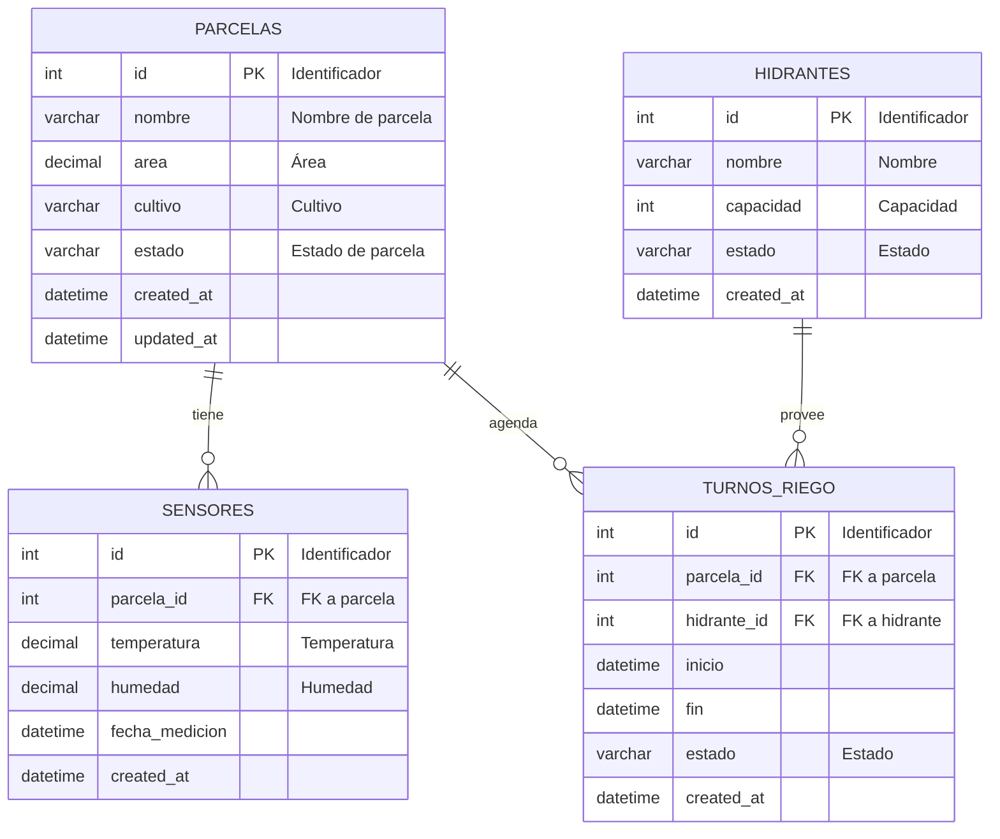

```mermaid
erDiagram
    PARCELAS {
        int id PK "Identificador"
        varchar nombre "Nombre de parcela"
        decimal area "Área"
        varchar cultivo "Cultivo"
        varchar estado "Estado de parcela"
        datetime created_at
        datetime updated_at
    }
    SENSORES {
        int id PK "Identificador"
        int parcela_id FK "FK a parcela"
        decimal temperatura "Temperatura"
        decimal humedad "Humedad"
        datetime fecha_medicion
        datetime created_at
    }
    HIDRANTES {
        int id PK "Identificador"
        varchar nombre "Nombre"
        int capacidad "Capacidad"
        varchar estado "Estado"
        datetime created_at
    }
    TURNOS_RIEGO {
        int id PK "Identificador"
        int parcela_id FK "FK a parcela"
        int hidrante_id FK "FK a hidrante"
        datetime inicio
        datetime fin
        varchar estado "Estado"
        datetime created_at
    }

    PARCELAS ||--o{ SENSORES : tiene
    PARCELAS ||--o{ TURNOS_RIEGO : agenda
    HIDRANTES ||--o{ TURNOS_RIEGO : provee
```