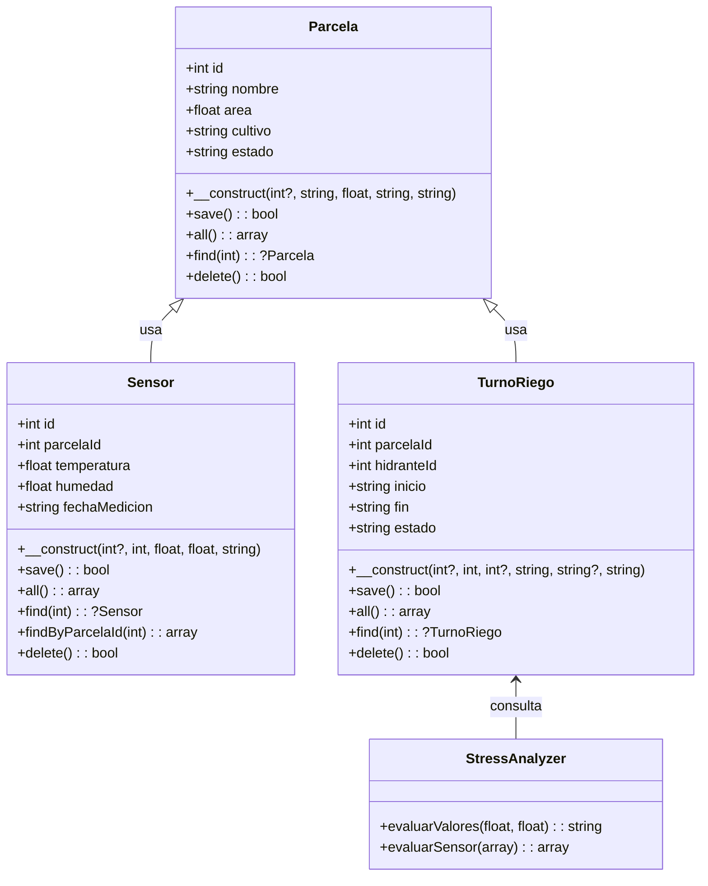

```mermaid
classDiagram
    class Parcela {
        +int id
        +string nombre
        +float area
        +string cultivo
        +string estado
        +__construct(int?, string, float, string, string)
        +save(): bool
        +all(): array
        +find(int): ?Parcela
        +delete(): bool
    }

    class Sensor {
        +int id
        +int parcelaId
        +float temperatura
        +float humedad
        +string fechaMedicion
        +__construct(int?, int, float, float, string)
        +save(): bool
        +all(): array
        +find(int): ?Sensor
        +findByParcelaId(int): array
        +delete(): bool
    }

    class TurnoRiego {
        +int id
        +int parcelaId
        +int hidranteId
        +string inicio
        +string fin
        +string estado
        +__construct(int?, int, int?, string, string?, string)
        +save(): bool
        +all(): array
        +find(int): ?TurnoRiego
        +delete(): bool
    }

    class StressAnalyzer {
        +evaluarValores(float, float): string
        +evaluarSensor(array): array
    }

    Parcela <|-- Sensor : usa
    Parcela <|-- TurnoRiego : usa
    TurnoRiego <-- StressAnalyzer : consulta
```