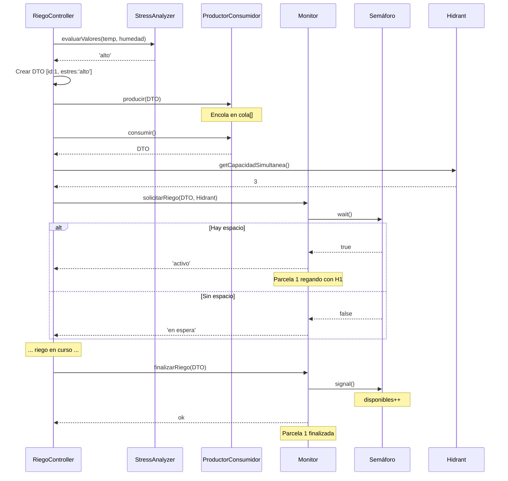

# Diagrama y Flujo de Control del Monitor

## Resumen del Sistema

El **Monitor** controla el acceso concurrente a múltiples **Hidrantes** usando **Semáforos** (patrones de concurrencia). Cada hidrante puede regar un número máximo de parcelas simultáneamente según su `capacidadSimultanea`.

El flujo se integra con:
- **ProductorConsumidor**: Encola parcelas según su estrés hídrico
- **LectoresEscritores**: Protege lecturas/escrituras en sensores
- **RiegoController** (Omar): Orquesta el riego llamando a los algoritmos

---

## Flujo wait() / signal()

### Semáforo.php - Operaciones Básicas

```php
// WAIT: Intenta decrementar disponibles
public function wait(): bool
{
    if ($this->disponibles <= 0) {
        return false;  // ❌ Sin recursos, se rechaza o encola
    }
    $this->disponibles--;
    return true;  // ✅ Recurso asignado
}

// SIGNAL: Libera un recurso (máximo hasta capacidad)
public function signal(): void
{
    if ($this->disponibles < $this->capacidad) {
        $this->disponibles++;  // Aumenta disponibles (nunca excede capacidad)
    }
}
```

### Monitor - Flujo Completo

```
SOLICITUD DE RIEGO
        ↓
[Monitor.solicitarRiego(parcela, hidrante)]
        ↓
¿Hidrante disponible? ────→ NO ────→ Retorna "bloqueado"
        ↓ SÍ
Obtener Semáforo del hidrante
        ↓
Llamar semaforo.wait()
        ↓
¿wait() retorna true? ────→ NO ────→ Retorna "en espera"
        ↓ SÍ
✅ Adicionar a activos[]
        ↓
Guardar asignación [parcela_id → hidrante_id]
        ↓
Retorna "activo"
        ↓
PARSIFICACIÓN EN RIEGO

FINALIZACIÓN DE RIEGO
        ↓
[Monitor.finalizarRiego(parcela)]
        ↓
Buscar hidrante en asignaciones[]
        ↓
Llamar semaforo.signal() del hidrante
        ↓
Liberar de activos[]
        ↓
Evento: espacio disponible
        ↓
FIN
```

---

## Diagrama Mermaid: Arquitectura Completa

```mermaid
graph TB
    RiegoController["<b>RiegoController</b><br/>(Omar)<br/>Orquesta el riego"]
    
    StressAnalyzer["<b>StressAnalyzer</b><br/>Evalúa estrés hídrico<br/>alto/medio/bajo"]
    
    ProductorConsumidor["<b>ProductorConsumidor</b><br/>Encola parcelas<br/>según estrés"]
    
    Monitor["<b>Monitor</b><br/>Controla acceso<br/>con Semáforos"]
    
    LectoresEscritores["<b>LectoresEscritores</b><br/>Protege sensores<br/>múltiples lectores/escritor"]
    
    Hidrante1["<b>Hidrant: Hidrante 1</b><br/>capacidadSimultanea: 3"]
    Hidrante2["<b>Hidrant: Hidrante 2</b><br/>capacidadSimultanea: 2"]
    
    Semaforo1["<b>Semáforo 1</b><br/>disponibles: 3"]
    Semaforo2["<b>Semáforo 2</b><br/>disponibles: 2"]
    
    Sensor1["<b>Sensor Temp</b><br/>Temperatura"]
    Sensor2["<b>Sensor Humedad</b><br/>Humedad"]
    
    RiegoController -->|1. Calcular estrés| StressAnalyzer
    StressAnalyzer -->|alto/medio/bajo| RiegoController
    
    RiegoController -->|2. Producir parcela| ProductorConsumidor
    ProductorConsumidor -->|3. Encola si alto/medio| ProductorConsumidor
    ProductorConsumidor -->|4. Consumir parcela| ProductorConsumidor
    
    ProductorConsumidor -->|5. Solicitar riego| Monitor
    Monitor -->|wait()| Semaforo1
    Monitor -->|wait()| Semaforo2
    Semaforo1 ---|activo/en espera| Monitor
    Semaforo2 ---|activo/en espera| Monitor
    
    Monitor -->|Vincular a| Hidrante1
    Monitor -->|Vincular a| Hidrante2
    Semaforo1 -->|Controla| Hidrante1
    Semaforo2 -->|Controla| Hidrante2
    
    Hidrante1 -->|Leyendo sensores| LectoresEscritores
    Hidrante2 -->|Leyendo sensores| LectoresEscritores
    
    LectoresEscritores -->|Leer| Sensor1
    LectoresEscritores -->|Leer| Sensor2
    LectoresEscritores -->|Escribir logs| Sensor1
    
    Monitor -->|6. Finalizar riego| Monitor
    Monitor -->|signal()| Semaforo1
    Monitor -->|signal()| Semaforo2
```

---

## Flujo de Llamadas desde RiegoController

### Paso a Paso

#### 1️⃣ **Obtener datos de parcelas y sensores**
```php
// RiegoController (Omar)
$parcela = $parcelaModel->getById($id);  // Objeto Parcela real
$temperatura = $sensorService->getTemperatura();
$humedad = $sensorService->getHumedad();
```

#### 2️⃣ **Calcular estrés hídrico (StressAnalyzer)**
```php
// Dani: Usar StressAnalyzer
$estres = StressAnalyzer::evaluarValores($temperatura, $humedad);
// Retorna: 'alto', 'medio' o 'bajo'
```

#### 3️⃣ **Preparar DTO para ProductorConsumidor**
```php
// Dani: Crear array simple (NO es objeto Parcela)
$parcelaDTO = [
    'id' => $parcela->getId(),           // int
    'nombre' => $parcela->getNombre(),   // string
    'estres_hidrico' => $estres          // 'alto'|'medio'|'bajo'
];
```

#### 4️⃣ **Producir (encolar si estrés alto/medio)**
```php
// Dani: ProductorConsumidor
$productor->producir($parcelaDTO);
// Interno: encola si estres = 'alto' o 'medio'
```

#### 5️⃣ **Consumir (desencolar)**
```php
// Dani: ProductorConsumidor
$parcelaLista = $productor->consumir();
// Retorna: array o null si cola vacía
```

#### 6️⃣ **Solicitar riego al Monitor**
```php
// Dani: Monitor
$hidrante = $hidrantRepository->getById('H1');  // Objeto Hidrant real

$resultado = $monitor->solicitarRiego($parcelaDTO, $hidrante);
// Resultado: 'activo' | 'en espera' | 'bloqueado'

if ($resultado === 'activo') {
    // Parcela regando ahora
} elseif ($resultado === 'en espera') {
    // Parcela encolada, sin espacio en hidrante
} else {
    // Hidrante no disponible
}
```

#### 7️⃣ **Leer sensores con LectoresEscritores (opcional)**
```php
// Dani: LectoresEscritores (protege concurrencia en sensores)
$temperatura = $lectoresEscritores->leer('temperatura', fn () => 
    $sensorService->getTemperatura()
);
```

#### 8️⃣ **Finalizar riego (liberar semáforo)**
```php
// Dani: Monitor
$monitor->finalizarRiego($parcelaDTO);
// Libera espacio en el hidrante, permite entrada de nuevas parcelas
```

---

## Interacciones Monitor ↔ Hidrant ↔ Semáforo

### Creación de Semáforos (Bajo Demanda)

```php
// Dentro de Monitor::solicitarRiego()
private function obtenerSemaforoHidrant(Hidrant $hidrante): Semaforo
{
    if (!isset($this->semaforos[$hidrante->id])) {
        // Crear semáforo con capacidad del hidrante
        $this->semaforos[$hidrante->id] = 
            new Semaforo($hidrante->capacidadSimultanea);
    }
    return $this->semaforos[$hidrante->id];
}
```

### Mapeo Parcela → Hidrante

```php
// Monitor mantiene asignaciones:
private array $asignaciones = [
    'P1' => 'H1',  // Parcela 1 riega con Hidrante 1
    'P2' => 'H1',  // Parcela 2 riega con Hidrante 1
    'P3' => 'H2',  // Parcela 3 riega con Hidrante 2
];

// En finalizarRiego():
$hidrantId = $this->asignaciones[$parcelaId];  // 'H1'
$this->semaforos[$hidrantId]->signal();         // Libera espacio
```

---

## Estados y Transiciones

### Estados de una Parcela

```
DESCARTADA
    (estrés bajo)
        ↑
        │
ENCOLADA → CONSUMIDA → SOLICITANDO_RIEGO
                            ↓
                        EN_ESPERA ↔ ACTIVA ← ← ↺ (ciclo)
                            ↑        ↓
                            └─ FINALIZADA
```

### Estado del Semáforo

```
Inicial:     disponibles = capacidad (ej: 3)
             
Solicitud:   wait() → disponibles-- → 2
Solicitud:   wait() → disponibles-- → 1
Solicitud:   wait() → disponibles-- → 0
Solicitud:   wait() → false (EN ESPERA)

Finalización: signal() → disponibles++ → 1
             (nueva parcela puede entrar)
```

---

## Integración con RiegoController (Omar)

### Pseudocódigo Esperado

```php
class RiegoController {
    private Monitor $monitor;
    private ProductorConsumidor $productor;
    private StressAnalyzer $analyzer;
    
    public function procesarRiego() {
        // 1. Obtener todas las parcelas
        $parcelas = $this->parcelaService->getAll();
        
        foreach ($parcelas as $parcela) {
            // 2. Calcular estrés
            $temp = $this->sensorService->getTemperatura($parcela->getId());
            $humedad = $this->sensorService->getHumedad($parcela->getId());
            $estres = StressAnalyzer::evaluarValores($temp, $humedad);
            
            // 3. Crear DTO y producir
            $dto = [
                'id' => $parcela->getId(),
                'nombre' => $parcela->getNombre(),
                'estres_hidrico' => $estres
            ];
            $this->productor->producir($dto);
        }
        
        // 4. Procesar cola
        while ($parcelaList = $this->productor->consumir()) {
            $hidrante = $this->hidrantRepository->getDefault();
            
            $resultado = $this->monitor->solicitarRiego($parcelaList, $hidrante);
            
            if ($resultado === 'activo') {
                // Iniciar riego
                $this->startIrrigation($parcelaList, $hidrante);
            }
            // else: espera o bloqueado
        }
        
        // 5. Cuando termina riego (callback/cron)
        foreach ($parcelasEnRiego as $p) {
            $this->monitor->finalizarRiego($p);  // Libera semáforo
        }
    }
}
```

---

## Resumen de Responsabilidades

| Componente | Responsabilidad | Entrada | Salida |
|---|---|---|---|
| **StressAnalyzer** | Evaluar estrés hídrico | temp, humedad | 'alto'\|'medio'\|'bajo' |
| **ProductorConsumidor** | Encolar/desencolar parcelas | array DTO | array \| null |
| **Monitor** | Control de semáforos | array DTO, Hidrant | 'activo'\|'en espera'\|'bloqueado' |
| **Semáforo** | Conteo de recursos | - | disponibles(int) |
| **Hidrant** | Metadatos (capacidad, disponibilidad) | - | capacidadSimultanea(int) |
| **LectoresEscritores** | Protección de sensores | callable | mixed |
| **RiegoController** | Orquestación | - | - |

---

## Diagrama Secuencial: Caso de Uso Completo



---

## Notas de Implementación

### ✅ Qué funciona ahora
- Monitor crea semáforos bajo demanda por hidrante
- Cada hidrante respeta su capacidad propia
- ProductorConsumidor trabaja con arrays (DTOs)
- LectoresEscritores simula protección de sensores

### ⚠️ Limitaciones actuales
- **Simulación**: No hay mutex real en PHP, solo contadores
- **SingleProcess**: Pruebas son síncronas (no concurrencia real)
- **Almacenamiento**: Semáforos se pierden si se reinicia Monitor

### 🔧 Futuras mejoras
- Persistencia de estado (Redis, Base de datos)
- Mutex real con `pthread` o `swoole` (PHP concurrente)
- Pub/Sub para notificaciones en tiempo real
- Métricas y alertas de cuellos de botella
